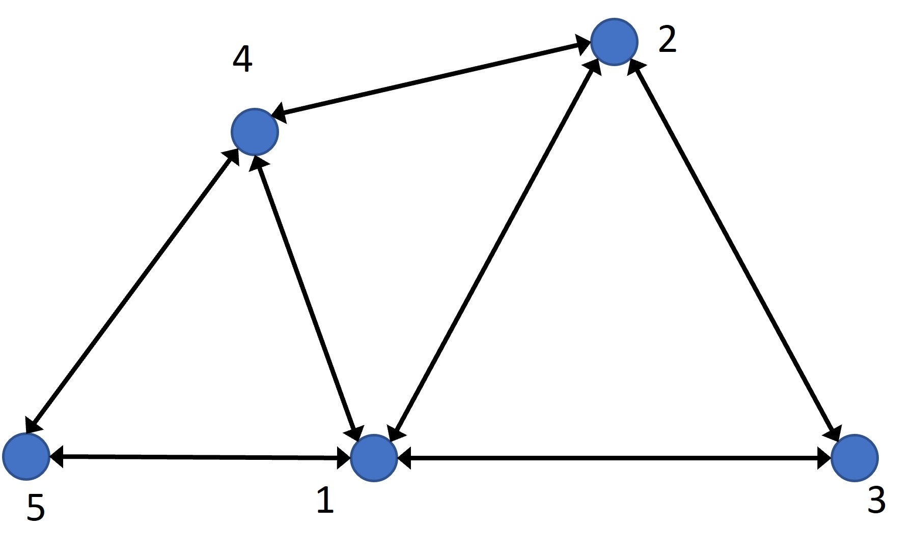

# MeshGraphNets

This code base contains PyTorch implementations of graph neural networks for CFD simulation surrogate development. The plan is to apply this code to predict volume fraction fields associated with CFD simulations of a representative column model (Fu et al., 2020) for solvent-based carbon capture within the CCSI2 project. 

Pfaff et al., 2021. "[Learning Mesh-Based Simulation with Graph Networks](https://arxiv.org/abs/2010.03409)." *International Conference on Learning Representations (ICLR)* (2021)

Fu et al., 2020. "[Investigation of Countercurrent Flow Profile and Liquid Holdup in Random Packed Column with Local CFD Data](https://www.sciencedirect.com/science/article/pii/S0009250920302256?)." *Chemical Engineering Science* 221 (2020)


## Authors
    - Phan Nguyen
    - Brian Bartoldson
    - Sam Nguyen
    - Jose Cadena
    - Rui Wang
    - David Widemann
    - Brenda Ng

# Other Contributors
- Paht Juangphanich 
  - Documentation, Plotting, Adaptation of datasets from [deepmind-research](https://github.com/deepmind/deepmind-research/tree/master/meshgraphnets)

## Requirements
    - matplotlib 
    - networkx 
    - numpy 
    - pandas 
    - scipy 
    - PyTorch 
    - PyTorch Geometric 
    - PyTorch Scatter 
    - tqdm

## Sample usage

```
cd training_scripts
bash train_mgn_config_cylinderflow_np.sh
```

# Dataset 
Dataset consists of two files: 
### Starting files
#### [`/data/cylinder_flow_comsol.csv`](https://github.com/pjuangph/MGN/blob/main/data/cylinder_flow_comsol.csv) 
Data in this file is structured as \[x, y, t (s), u (m/s), v (m/s), P (Pa)\] with `x` and `y` being the vertices of the elements of the mesh. 
Notice that there's a time, this file contains 600 time samples of u,v,P at each vertex. 

### [`/data/mesh_comsol_output.txt`](https://github.com/pjuangph/MGN/blob/main/data/mesh_comsol_output.txt)
This file contains the verticies and element to element connectivity. There are a total of **2520 vertices**.

> % Coordinates (x, y
2.187223786996194        0.01511668485418859      
2.181512605042017        0.008144843910914357     
2.2                      0.00814484391091436      
2.2                      0.01623985272861472     

As you scroll down you get to this. The rows of this table correspond to the element index. The columns show which vertices (2520 total) belong in the element. 
> % Elements (triangles), These are mesh_elements 
1         2         3    <--- Row = each element
4         1         3         
5         6         2     

### Graph Data Structure
Torch Geometric Graph Data requires the following:
- x: Features describing each vertex. In this case (u,v, x, y, 0, 0, 0, 1)
  - u and v are the velocity in the x and y directions
  - x and y are the coordinates of each vertex
  - The 0,0,0,1 describes the type of each node. This is encoded using a oneshot so oneshot([2],4) becomes [0 1 0 0]
    - onehot([0],4) describes the interior 
    - onehot([1],4) describes the outlet 
    - onehot([2],4) describes the inlet 
    - onehot([3],4) describes the walls 
- y: Output that you are predicting
- pos: Position in x,y,z of each vertex
- edge_connectivity: This is a matrix describing which vertices are connected to what. Uni-directional: \[1,2\] means 1 is sending information to 2. Bi-directional would look like \[\[1,2\], \[2,1\]\]. A mesh like the example is bi-directional.

#### edge_connectivity: Finding Element to Element connectivity

To find the element-to-element connectivity, The distance between each mesh_node and node_coordinate was calculated. The minimum value is used to reorder the mesh_elements. See [get_comsol_edges](https://github.com/pjuangph/MGN/blob/9b15befa36de19671161a1552d22c318bab10d8b/GNN/DatasetClasses/CylinderFlowDataset2.py#L52) 

A given vertex can exchange information with it's connected neighbors.


## Graph Data Structure
The example the author provided is cylinder flow. The [dataset class](https://github.com/pjuangph/MGN/blob/main/GNN/DatasetClasses/CylinderFlowDataset2.py) 

# Architecture

# Results
[Results - really big gif](https://nasa-public-data.s3.amazonaws.com/plot3d_utilities/mesh_graph_nets_cylinder_flow-100.gif)


# Release

LLNL release number: LLNL-CODE-829430


